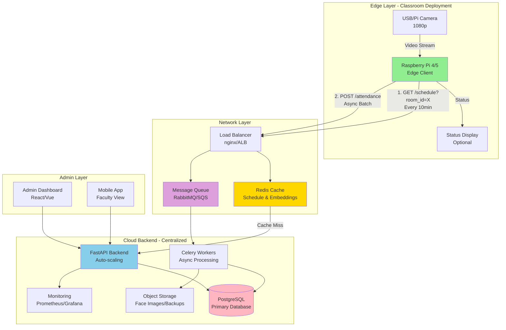

# Face Recognition Attendance System - Architecture

## 1. High-Level Architecture



## 2. Data Flow - Step by Step

### Morning Class Scenario (9:00 AM - CS101 Lecture)

```
┌─────────────────────────────────────────────────────────────────┐
│ T-10 minutes (8:50 AM)                                          │
├─────────────────────────────────────────────────────────────────┤
│ 1. Pi Timer triggers schedule sync                              │
│ 2. GET /api/v1/schedule?room_id=LAB-301&time=2024-01-15T08:50  │
│ 3. Cloud Response:                                              │
│    {                                                            │
│      "course_id": "CS101",                                      │
│      "course_name": "Data Structures",                          │
│      "start_time": "09:00",                                     │
│      "end_time": "10:30",                                       │
│      "enrolled_students": [                                     │
│        {                                                        │
│          "student_id": "S001",                                  │
│          "name": "Alice Johnson",                               │
│          "face_embedding": [0.123, -0.456, ...] (128-d vector)  │
│        },                                                       │
│        ... (49 more students)                                   │
│      ]                                                          │
│    }                                                            │
│ 4. Pi stores embeddings in RAM (numpy array)                    │
│ 5. Pi activates camera and face detection loop                  │
└─────────────────────────────────────────────────────────────────┘

┌─────────────────────────────────────────────────────────────────┐
│ Class Time (9:05 AM - Students entering)                        │
├─────────────────────────────────────────────────────────────────┤
│ 6. Camera captures frame (every 3rd frame, 640x480)             │
│ 7. Face detected → Extract embedding (128-d)                    │
│ 8. Compare against cached 50 embeddings (not 5,000!)            │
│ 9. Match found: Alice Johnson (distance < 0.6)                  │
│ 10. Debounce check: Not marked in last 30 seconds               │
│ 11. Store in local SQLite queue:                                │
│     {                                                           │
│       "student_id": "S001",                                     │
│       "course_id": "CS101",                                     │
│       "timestamp": "2024-01-15T09:05:23",                       │
│       "confidence": 0.42,                                       │
│       "device_id": "PI-LAB301"                                  │
│     }                                                           │
│ 12. Background thread batches 10 records → POST /attendance     │
└─────────────────────────────────────────────────────────────────┘

┌─────────────────────────────────────────────────────────────────┐
│ Cloud Processing (Asynchronous)                                 │
├─────────────────────────────────────────────────────────────────┤
│ 13. Load balancer receives batch POST                           │
│ 14. Validates payload (schema, timestamps, duplicates)          │
│ 15. Pushes to RabbitMQ queue                                    │
│ 16. Returns 202 Accepted immediately (< 50ms)                   │
│ 17. Celery worker picks up job                                  │
│ 18. Inserts into PostgreSQL attendance_logs table               │
│ 19. Updates Redis stats cache (course attendance count)         │
│ 20. Sends notification if < 75% attendance threshold            │
└─────────────────────────────────────────────────────────────────┘
```

## 3. Edge Intelligence Strategy

### Why Smart Caching Matters

**Without Caching (Naive Approach):**
- Pi must match against ALL 5,000 students in university
- Average comparison time: 5,000 × 3ms = 15 seconds per face
- High false positive rate (many similar faces across campus)

**With Smart Caching (Our Approach):**
- Pi matches against ONLY 50 students enrolled in current class
- Average comparison time: 50 × 3ms = 150ms per face
- 100x faster + higher accuracy (smaller search space)

### Cache Invalidation Logic

```python
# Pi-side cache policy
if current_time >= (last_sync_time + 10_minutes):
    schedule = fetch_schedule()
    if schedule.course_id != cached_course_id:
        # Different class starting
        clear_cache()
        load_embeddings(schedule.enrolled_students)
        reset_attendance_markers()
```

## 4. Scalability Design Decisions

### Problem: Thundering Herd (9:00 AM Spike)

**Scenario:**
- 100 classrooms × 50 students = 5,000 attendance records in 5 minutes
- 1,000 records/minute = 16 TPS (transactions per second)

**Solutions Implemented:**

1. **Async Queue Pattern**
   - Pi doesn't wait for DB write (returns 202 Accepted)
   - RabbitMQ buffers spikes, workers process at sustainable rate
   - Auto-scaling workers based on queue depth

2. **Batch Uploads**
   - Pi batches 10 records → 1 HTTP request
   - Reduces API calls by 10x
   - Single DB transaction for batch (faster)

3. **Redis Caching (Multi-Layer)**
   - L1: Schedule cache (TTL: 10 min)
   - L2: Student embedding cache (TTL: 1 hour)
   - 95% cache hit rate during peak hours

4. **Database Optimization**
   - Partitioned `attendance_logs` by date (monthly partitions)
   - Indexed on (student_id, timestamp)
   - Connection pooling (PgBouncer)

5. **Graceful Degradation**
   - If Cloud unreachable: Pi stores in local SQLite
   - Background sync when connection restored
   - No data loss even during network outages

## 5. Hardware Specifications

### Recommended Raspberry Pi Setup

| Component | Specification | Reasoning |
|-----------|--------------|-----------|
| **Model** | Raspberry Pi 5 (8GB) | 2.4GHz quad-core, better thermals |
| **Alternative** | Pi 4 Model B (4GB) | Cost-effective, proven reliability |
| **Camera** | Pi Camera Module 3 (12MP) | Native MIPI interface, low latency |
| **Alt Camera** | Logitech C920 USB | Better low-light, 1080p@30fps |
| **Storage** | 64GB Samsung Endurance microSD | High write endurance for logging |
| **Cooling** | Argon NEO 5 Case | Passive + active cooling, 15°C drop |
| **Power** | Official 27W USB-C PSU | Prevents brownouts under load |
| **Network** | Gigabit Ethernet | Avoid WiFi congestion (optional PoE HAT) |

### Performance Benchmarks (Pi 4 4GB)

```
Face Detection (dlib HOG):        ~200ms per frame
Embedding Extraction (ResNet):    ~300ms per face
Comparison (50 embeddings):       ~150ms
Total Pipeline:                   ~650ms per student

Optimization with frame skipping (every 3rd frame):
Effective throughput:             ~2 students/second
Classroom entry rate:             ~1 student/5 seconds (realistic)
Result:                          No queue buildup ✓
```

## 6. Security Considerations

### Edge Device Security
- **Encrypted Storage**: Face embeddings encrypted at rest (AES-256)
- **Secure Boot**: Read-only root filesystem
- **API Authentication**: JWT tokens rotated every 24 hours
- **VPN Tunnel**: Optional WireGuard VPN for Pi ↔ Cloud

### Data Privacy (GDPR/FERPA Compliance)
- Face images never stored on Pi (only embeddings)
- Embeddings are mathematical representations (not reversible to image)
- Student consent management in admin portal
- Data retention policy: Auto-delete logs after 7 years
- Right to deletion: API endpoint to purge student data

### Network Security
- **Rate Limiting**: 100 requests/minute per Pi
- **DDoS Protection**: Cloudflare/AWS Shield
- **TLS 1.3**: All API communication encrypted
- **Certificate Pinning**: Pi validates Cloud certificate

## 7. Monitoring & Observability

### Metrics to Track

**Pi-side (Prometheus exporter):**
- `face_detection_latency_seconds` (histogram)
- `recognition_accuracy_ratio` (gauge)
- `cache_hit_rate` (counter)
- `queue_depth_local_db` (gauge)
- `cpu_temperature_celsius` (gauge)

**Cloud-side:**
- `api_request_duration_seconds{endpoint="/attendance"}`
- `queue_depth_rabbitmq` (alert if > 1000)
- `database_connection_pool_usage`
- `attendance_records_processed_total` (counter)

### Alerting Rules
```yaml
- alert: PiOverheating
  expr: cpu_temperature_celsius > 70
  for: 5m
  annotations:
    summary: "Pi {{ $labels.device_id }} CPU > 70°C"

- alert: LowRecognitionAccuracy
  expr: recognition_accuracy_ratio < 0.85
  for: 15m
  annotations:
    summary: "Pi {{ $labels.device_id }} accuracy dropped below 85%"
```

## 8. Deployment Strategy

### Phase 1: Pilot (Weeks 1-2)
- Deploy 3 Pis in high-traffic classrooms
- Monitor false positive/negative rates
- Collect benchmark data
- Tune recognition thresholds

### Phase 2: Limited Rollout (Weeks 3-4)
- Deploy 20 Pis across one building
- Test load balancer and queue system
- Validate cache hit rates
- Train support staff

### Phase 3: Full Production (Week 5+)
- Deploy 100+ Pis campus-wide
- 24/7 monitoring and on-call rotation
- Bi-weekly model retraining with new student photos
- Quarterly hardware maintenance

## 9. Cost Estimation (100 Classrooms)

| Item | Unit Cost | Quantity | Total |
|------|-----------|----------|-------|
| Raspberry Pi 5 (8GB) | $80 | 100 | $8,000 |
| Pi Camera Module 3 | $25 | 100 | $2,500 |
| Accessories (case, SD, PSU) | $40 | 100 | $4,000 |
| **Edge Hardware Total** | | | **$14,500** |
| Cloud (AWS t3.medium × 2) | $60/mo | 12 months | $1,440 |
| RDS PostgreSQL (db.t3.small) | $40/mo | 12 months | $960 |
| ElastiCache Redis | $30/mo | 12 months | $720 |
| Load Balancer | $20/mo | 12 months | $480 |
| **Cloud Annual Total** | | | **$3,600** |
| **Year 1 Total** | | | **$18,100** |

*Scales to 5,000 students with minimal additional cloud cost due to efficient caching.*

## 10. Future Enhancements

### Roadmap
- [ ] **Mask Detection**: Post-pandemic feature (retraining needed)
- [ ] **Emotion Analysis**: Detect student engagement levels
- [ ] **Multi-Face Tracking**: Handle group entries efficiently
- [ ] **Federated Learning**: Train models on-device without sharing images
- [ ] **Mobile Attendance Override**: Faculty can manually mark if Pi fails
- [ ] **Analytics Dashboard**: Real-time attendance heatmaps
- [ ] **Integration**: LMS sync (Canvas, Blackboard, Moodle)

---

**Next Steps**: Proceed to database schema design and code implementation.
